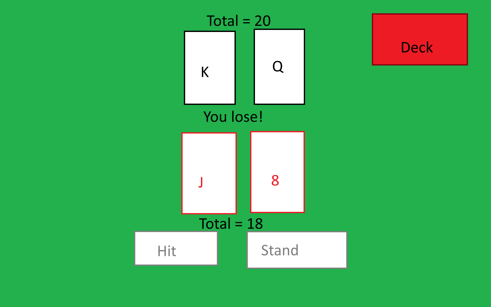
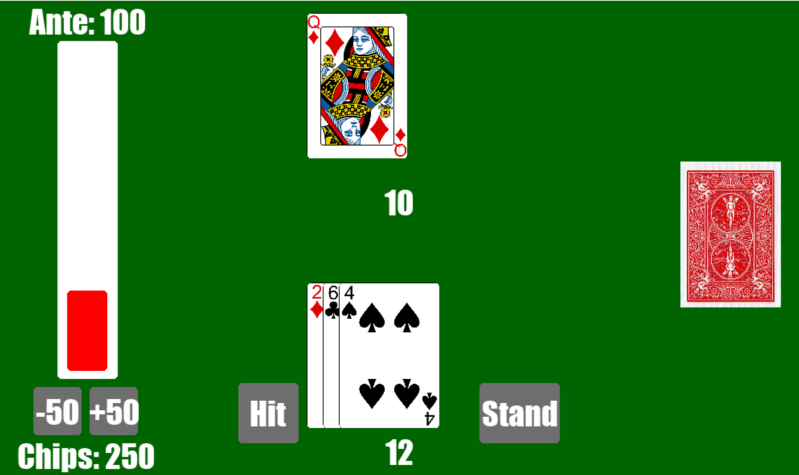

# Brendan's Blackjack
## CS110 Final Project  Fall, 2024

## Team Members

Brendan Kearney

***

## Project Description

A simple blackjack game with antes, and all the typical features of blackjack

# Additional Modules
 - pygame
 - random

***    

## GUI Design

### Initial Design

### Final Design

## Program Design

### Features

1. Hit
2. Stand
3. Antes

### Classes

- Card
    - contains all of the data needed for a card, including a rank, suit, value, and image file with functions to return the card as a string in the console and to get the image file
- Deck
    - uses the card class to create a list of card objects to form a deck, with functions to deal a card and return the length of the deck to check for reshuffling
- Button
    - used to create a usable button on screen, with functions to draw the button and to check if the players mouse collides with the button
- Controller
    - used for the main game loops and the game logic

## ATP

Step 1: Start Game
    - Open terminal, navigate to project folder, type: python main.py
    - Press enter
    - **expected outcome**
    - green screen with a Start Game button appears

Step 2: Play Game
    - click on the 'Play Game' button in the center of the screen
    - **expected outcome**
    - game should switch to a UI with hit, stand, ante options, and draw the first 3 cards

Step 3: Ante
    - click on either the +50 or -50 buttons to     raise or lower your ante
    **expected outcome**
    - bar representing your ante should increase or decrease depending on the selected amount you chose to ante

Step 4: Hit
    - click on the button to 'hit'
    - **expected outcome**
    - a card should appear in your hand, and it should be added to your total hand value
    - if it is > 21, you bust
    - under 21, you can either hit again or stand
    - = 21, blackjack!

Step 5: Stand
    - click on the button to 'stand'
    - **expected outcome**
    - dealer should draw cards depending on if their hand is below or above 17
    - game should calculate the winner and display it properly
